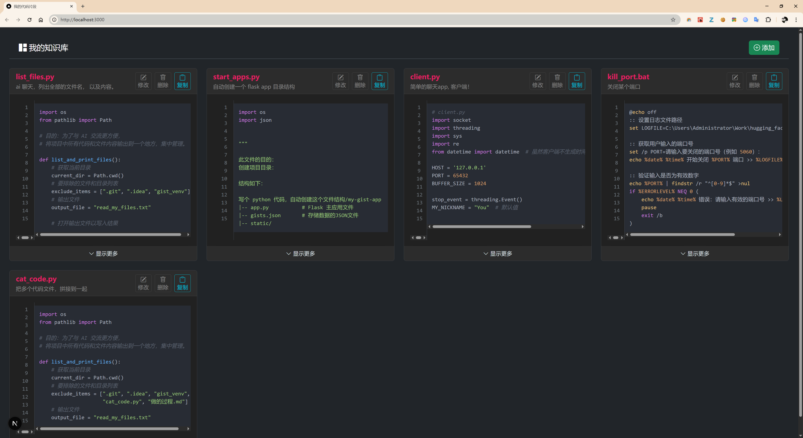

# My Code Snippet App (next-js-gist-app)

一个使用 Next.js 构建的、用于管理个人代码片段的知识库应用。本项目是对一个原有 Python/Flask 项目的完全重构，旨在体验和学习现代全栈开发框架。



---

## ✨ 功能特性

- **网格布局展示**: 以清晰的卡片网格形式，浏览所有代码片段。
- **语法高亮**: 自动识别代码语言并提供精准的语法高亮。
- **完整的 CRUD 操作**:
    - **创建 (Create)**: 通过模态框添加新的代码片段。
    - **读取 (Read)**: 查看片段列表及独立的详情页。
    - **更新 (Update)**: 编辑已有的代码片段。
    - **删除 (Delete)**: 移除不再需要的代码片段。
- **丰富的交互**:
    - **一键复制**: 快速将代码内容复制到剪贴板。
    - **展开/收起**: 对于过长的代码，可以方便地展开或收起。
- **响应式设计**: 兼容桌面、平板和移动设备。

---

## 🛠️ 技术栈

- **框架**: [Next.js](https://nextjs.org/) (使用 App Router)
- **前端**: [React](https://react.dev/), [TypeScript](https://www.typescriptlang.org/)
- **UI & 样式**: [Bootstrap 5](https://getbootstrap.com/), 自定义 CSS
- **代码高亮**: [Highlight.js](https://highlightjs.org/)
- **数据存储**: 本地 `gists.json` 文件 (用于本地开发)

---

## 🚀 本地运行

按照以下步骤，在你的本地环境中运行此项目。

**1. 克隆仓库**

```bash
git clone https://github.com/buxuele/next-js-gist-app
cd next-js-gist-app
```

**2. 安装依赖**

本项目使用 npm 作为包管理器。

```bash
npm install
```

**3. 创建数据文件 (重要！)**

请检查是否有一个 `gists.json` 的文件。


**4. 启动开发服务器**

```bash
npm run dev
```

**5. 打开应用**

在你的浏览器中打开 [http://localhost:3000](http://localhost:3000) 查看效果。


